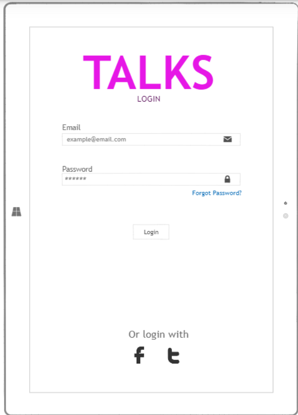
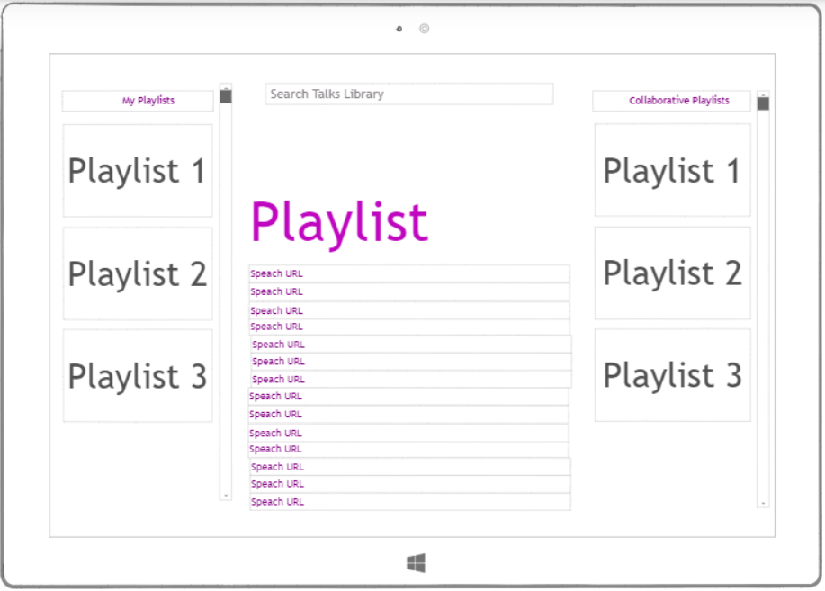

# startup

# Elevator Pitch

Everyone's listened to someone giving a speach. Maybe you were sitting in the far back. You could hear the crowd laugh, but you couldn't hear the joke. You turn to your neighbor: "What did they say?" Well, NO MORE! Talks (TM) is a new application designed to bring the speaker to you. With Talks (TM) you can save all of your favoirte talks by your favorite speakers. Then, you can share what you love by creating a collabrotive playlist of speaches with all your friends. Inspiration has never been easier.

# Key Features

- Search for speaches that are pulled from the internet.
- Persistently save playlists of speeches.
- Securely log in and view your saved playlists.
- Share playlists with other users and allow for real-time collaboration.

# Description of Technology

## HTML

Talks (TM) will use correct HTML structure for the application. Three HTML pages will be included: one for login, one for selecting a playlist, and and one for viewing, editing,and sharing a playlist.

## CSS

Talks (TM) will use appropriate application styling that looks good on different screen sizes, uses good whitespace, color choice and contrast.

## JavaScript

Talks (TM) will use Javascript to provide login, talk/playlist displays, playlist management (editing, adding, removing, reordering), and backend endpoint calls.

## Authentication and other services

Authentication will be used to create user accounts and log users in. It will also be used when sharing playlists so that only users that have access to a playlist can view and contribute to it.

## Database data

A database will be necessary to persistently store user login information, authtokens, playlists, and other applicaiton information.

## WebSocket data

WebSockets will be used when viewing, adding to, removing from, or otherwise making changes to collaborative playlists with other users in real time. If a change is made to a collaborative playlist, that change is reflected in real time to all other users that the playlist is shared with.

# React

Talks (TM) will be ported to use the React web framework.

# Application sketches

